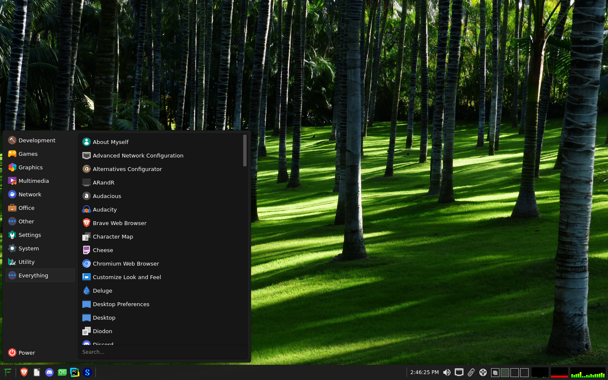

# Forest

Forest is a lightweight desktop environment for Linux built with C++ and Qt. It has a modular design and is fully themeable via QSS (Qt style sheets).

It can be used with various window managers and compositors, but xfwm4 is recommended.



## Installation

Download the latest `.deb` package from the [releases page](https://github.com/nicholasyoder/forest/releases) and install it:

```sh
sudo apt install ./forest_*.deb
```

### Greeter (login screen)

The `forest-greeter` package installs `greetd` and a config pointing it at Forest's
greeter, but does **not** enable or start `greetd.service` automatically — this avoids
conflicting with any display manager you may already have enabled. If you want to use
the Forest greeter as your login screen, disable any existing display manager and
enable greetd yourself:

```sh
sudo systemctl disable --now <existing-display-manager>.service
sudo systemctl enable --now greetd.service
```

## Building from Source

**Dependencies Include:** CMake, Qt6, KF6WindowSystem, Qt6Xdg, X11/Xcb, ALSA (libasound2), libsensors

All dependencies should be available in the Debian 13 (Trixie) official repositories. Compatibility with the library versions on other distros is not guaranteed.

```sh
cmake -B build
cmake --build build
sudo cmake --install build
```
