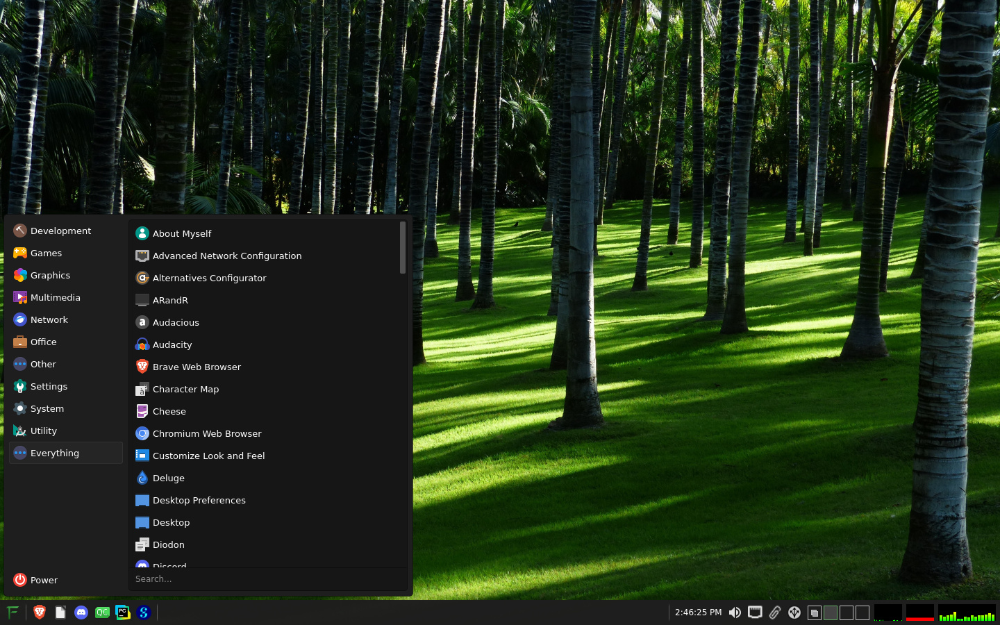

# Forest

Forest is a lightweight desktop environment for Linux built with C++ and Qt. It has a modular design and is fully themeable via QSS (Qt style sheets).

It requires the [Biome](https://github.com/nicholasyoder/biome) Wayland compositor (or another compositor speaking the same protocols) — Forest's shell is Wayland-native and will not work correctly under X11.



## Installation

Download the latest `.deb` package from the [releases page](https://github.com/nicholasyoder/forest/releases) and install it:

```sh
sudo apt install ./forest_*.deb
```

By default apt also installs recommended packages, and some of Forest's dependencies recommend parts of LXQt. Most notably, `pcmanfm-qt` pulls in `lxqt-session`, which adds an LXQt entry to the login screen. To install only what Forest needs, add `--no-install-recommends`:

```sh
sudo apt install --no-install-recommends ./biome_*.deb ./forest_*.deb ./forest-greeter_*.deb
```

### Greeter (login screen)

The `forest-greeter` package installs `greetd` and a config pointing it at Forest's
greeter, but does **not** enable or start `greetd.service` automatically — this avoids
conflicting with any display manager you may already have enabled. If you want to use
the Forest greeter as your login screen, disable any existing display manager and
enable greetd yourself:

```sh
sudo systemctl disable --now <existing-display-manager>.service
sudo systemctl enable --now greetd.service
```

## Building from Source

**Dependencies Include:** CMake, Qt6, LayerShellQt, Qt6Xdg, libXcursor, xkbcommon, ALSA (libasound2), libsensors

All dependencies should be available in the Debian 13 (Trixie) official repositories. Compatibility with the library versions on other distros is not guaranteed.

```sh
cmake -B build
cmake --build build
sudo cmake --install build
```

## Packaging

Debian packages can be built from `debian/` with:

```sh
sudo apt build-dep .            # once: installs debian/control's Build-Depends
dpkg-buildpackage -us -uc -b    # or `debuild -us -uc` (devscripts) to also run lintian
```

This produces `../forest_<version>_amd64.deb` and `../forest-greeter_<version>_amd64.deb` (plus a `-dbgsym` package for each); it doesn't install anything locally. The version comes from the top entry of `debian/changelog`. For cutting a release, see [docs/development-notes.md](docs/development-notes.md#release-packaging).

It builds the working tree as-is, uncommitted changes included.

`forest` depends on `biome`, so on a fresh system install the [Biome](https://github.com/nicholasyoder/biome) `.deb` first or in the same command.

It leaves build byproducts in the tree (`obj-*-linux-gnu/`, `debian/forest/`, `debian/forest-greeter/`, etc., all gitignored). Remove them with:

```sh
dpkg-buildpackage -Tclean
```
